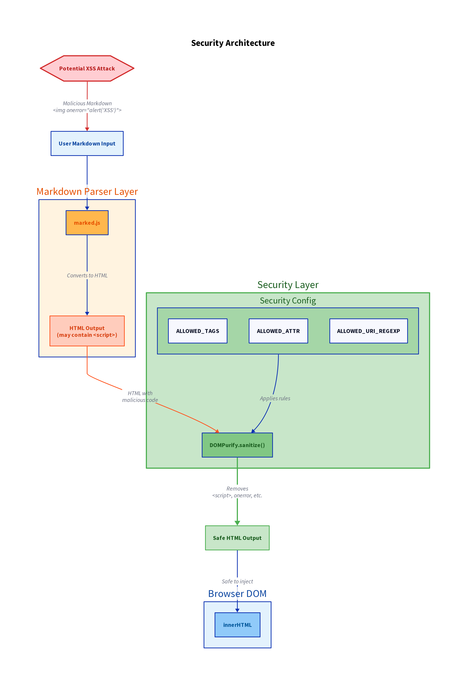

# Security Documentation

## Overview

LinkNote takes security seriously. This document outlines the security measures implemented to protect users from common web vulnerabilities, particularly Cross-Site Scripting (XSS) attacks.

---

## XSS Protection



### The Problem

Cross-Site Scripting (XSS) is a security vulnerability where malicious scripts are injected into otherwise benign websites. In a Markdown editor, users could potentially write Markdown that contains:

- JavaScript code in `<script>` tags
- Event handlers like `onclick`, `onerror`, etc.
- Malicious `javascript:` URLs
- Data URIs containing executable code

**Example malicious Markdown:**
```markdown
<script>alert('XSS')</script>

[Click me](javascript:alert('XSS'))
```

### The Solution

LinkNote uses **DOMPurify** to sanitize all HTML before rendering it in the preview pane.

#### How It Works

1. **User types Markdown** in the editor
2. **marked.js parses** Markdown → HTML
3. **DOMPurify sanitizes** the HTML
4. **Safe HTML** is rendered in the preview

```javascript
// In MarkdownEngine.parse()
const rawHtml = marked.parse(markdown);        // Parse Markdown
const cleanHtml = DOMPurify.sanitize(rawHtml); // Sanitize HTML
preview.innerHTML = cleanHtml;                 // Safe to inject
```

#### What Gets Blocked

DOMPurify automatically removes or neutralizes:

- ✅ `<script>` tags and their contents
- ✅ Event handlers (`onclick`, `onload`, `onerror`, etc.)
- ✅ `javascript:` protocol in links
- ✅ `data:` URIs (except safe image formats)
- ✅ `<iframe>`, `<object>`, `<embed>` tags
- ✅ Dangerous attributes (`formaction`, etc.)
- ✅ CSS expressions
- ✅ HTML imports

#### What's Allowed

Common Markdown/HTML elements are preserved:

- ✅ Headings (`<h1>` through `<h6>`)
- ✅ Paragraphs and line breaks
- ✅ Text formatting (`<strong>`, `<em>`, `<code>`, etc.)
- ✅ Lists (`<ul>`, `<ol>`, `<li>`)
- ✅ Links with `http(s):` and `mailto:` protocols
- ✅ Images from `http(s):` URLs
- ✅ Tables
- ✅ Blockquotes
- ✅ Code blocks

---

## Testing XSS Protection

You can test the XSS protection by trying to inject malicious code:

### Test Case 1: Script Tag
**Input:**
```markdown
<script>alert('XSS')</script>
```
**Result:** Script tag is removed, no JavaScript executes

### Test Case 2: Event Handler
**Input:**
```markdown

```
**Result:** `onerror` attribute is removed

### Test Case 3: JavaScript URL
**Input:**
```markdown
[Click me](javascript:alert('XSS'))
```
**Result:** Link is removed or neutralized

### Test Case 4: Data URI
**Input:**
```markdown
alert('XSS')</script>">
```
**Result:** Dangerous data URI is blocked

### Test Case 5: Safe Link
**Input:**
```markdown
[Safe link](https://example.com)
```
**Result:** ✅ Link works normally

---

## Configuration

DOMPurify is configured with specific allowed tags and attributes:

```javascript
DOMPurify.sanitize(rawHtml, {
    ALLOWED_TAGS: [
        'h1', 'h2', 'h3', 'h4', 'h5', 'h6',
        'p', 'br', 'hr',
        'strong', 'em', 'b', 'i', 'u', 's', 'del', 'mark', 'sub', 'sup',
        'ul', 'ol', 'li',
        'blockquote', 'pre', 'code',
        'a', 'img',
        'table', 'thead', 'tbody', 'tr', 'th', 'td',
        'div', 'span',
        'details', 'summary'
    ],
    ALLOWED_ATTR: [
        'href', 'title', 'alt', 'src',
        'class', 'id',
        'align', 'width', 'height',
        'target', 'rel'
    ],
    ALLOWED_URI_REGEXP: /^(?:(?:(?:f|ht)tps?|mailto|tel|callto|sms|cid|xmpp):|[^a-z]|[a-z+.\-]+(?:[^a-z+.\-:]|$))/i,
    FORCE_BODY: true
});
```

### Why These Settings?

- **ALLOWED_TAGS**: Only tags needed for Markdown rendering
- **ALLOWED_ATTR**: Only safe attributes that don't execute code
- **ALLOWED_URI_REGEXP**: Only safe protocols (http, https, mailto, etc.)
- **FORCE_BODY**: Ensures output is wrapped in a safe container

---

## Other Security Measures

### 1. Content Security Policy (Recommended)

While not currently implemented, you can add CSP headers to further restrict what scripts can run:

```html
<meta http-equiv="Content-Security-Policy"
      content="default-src 'self';
               script-src 'self' https://cdn.jsdelivr.net;
               style-src 'self' 'unsafe-inline' https://fonts.googleapis.com;
               font-src https://fonts.gstatic.com;
               img-src * data:;">
```

### 2. No eval() or Function()

The codebase does not use `eval()`, `Function()`, or `setTimeout(string)` which could execute arbitrary code.

### 3. Strict Mode

All JavaScript runs in strict mode (`"use strict";`) to catch common coding errors.

### 4. URL Encoding

Content in the URL fragment is Base64-encoded, not executed as code.

### 5. Library Security

- **marked.js**: Updated regularly, no known vulnerabilities
- **DOMPurify**: Industry-standard HTML sanitizer, actively maintained

---

## Threat Model

### What LinkNote Protects Against

✅ **XSS via Markdown**: Malicious scripts in user content
✅ **XSS via URL**: Malicious scripts in shared URLs
✅ **HTML injection**: Arbitrary HTML that could break the page

### What LinkNote Does NOT Protect Against

❌ **URL Privacy**: URLs are visible in browser history and can be shared
❌ **Content Privacy**: Anyone with the URL can read the content

---

## Reporting Security Issues

If you discover a security vulnerability in LinkNote:

1. **Do NOT** open a public GitHub issue
2. **Email** the maintainers privately (see SECURITY.md)
3. **Include** steps to reproduce the vulnerability
4. **Allow** time for a fix before public disclosure

---

## Updates and Maintenance

### Dependency Updates

Regularly check for updates to:
- marked.js: Check [npm](https://www.npmjs.com/package/marked) or [GitHub](https://github.com/markedjs/marked)
- DOMPurify: Check [npm](https://www.npmjs.com/package/dompurify) or [GitHub](https://github.com/cure53/DOMPurify)

### Security Advisories

Monitor security advisories:
- [GitHub Security Advisories](https://github.com/advisories)
- [npm Security Advisories](https://github.com/advisories?query=type%3Areviewed+ecosystem%3Anpm)

---

## Best Practices for Users

1. **Don't trust all shared URLs**: Be cautious of LinkNote URLs from unknown sources
2. **Use HTTPS**: Always access LinkNote over HTTPS in production
3. **Keep browser updated**: Modern browsers have additional security features
4. **Be careful with sensitive data**: URLs are not encrypted

---

## Conclusion

LinkNote implements industry-standard XSS protection via DOMPurify. While Markdown is user-generated content, it is sanitized before rendering to prevent malicious code execution.

**Key Points:**
- ✅ DOMPurify sanitizes all HTML
- ✅ XSS attacks are prevented
- ✅ Common Markdown features work normally
- ✅ Regular security updates recommended

For questions or concerns, please refer to the main documentation or open a GitHub issue (for non-security bugs).
